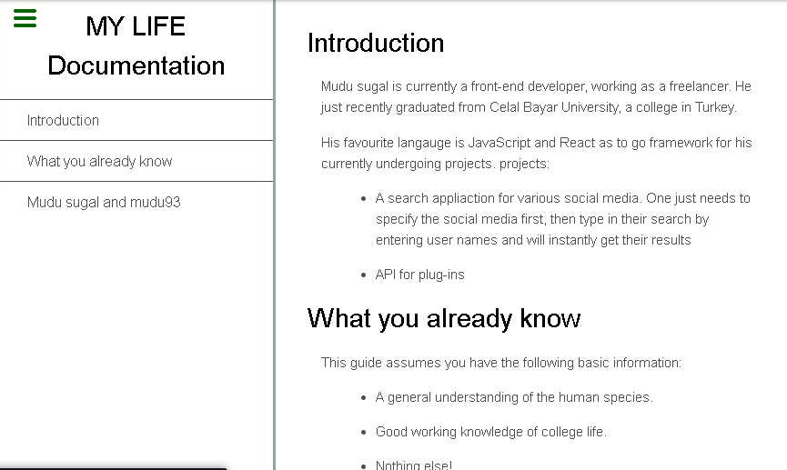

# Technical Documentation Page  😎
A responsive web design for a technical documentation page

This was a challenge that's on FreeCodeCamp.org at https://learn.freecodecamp.org/responsive-web-design/responsive-web-design-projects/build-a-technical-documentation-page/  

You can use [codepen.io]() as your editor 

## Note:
   the code files are zipped so you gotta download and use as you wish
